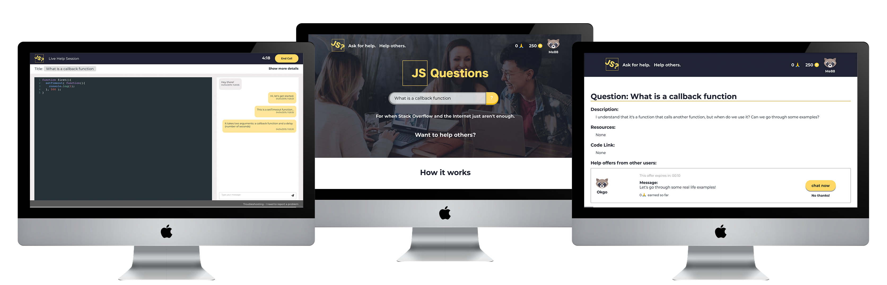
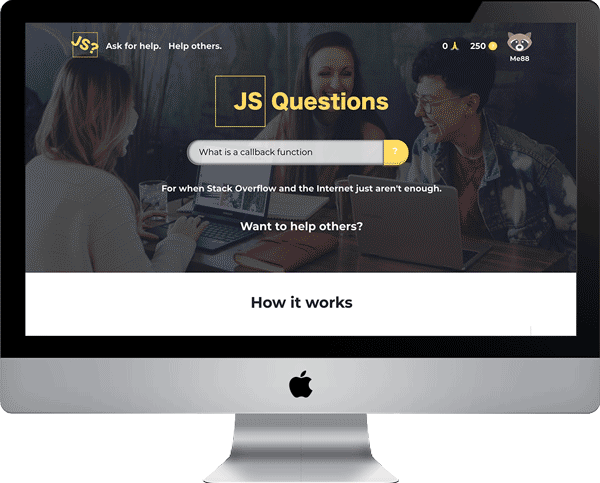

## 

## Table of contents

- [Preview Files](#Preview-Files)

- [Getting started](#getting-started)

- [Tech Stack](#tech-stack)

- [Developers team](#developers-team)

  

### Preview Files




<div align="center"></div>


## Getting Started

Please start with back-end set up first. After cloning the repository and once backend is completed to set up the front-end in terminal run:

```
docker-compose up
```


...Grab some coffee because this will take awhile to complete...

After go to - http://localhost:3000/ and now you are ready to start developing!


## Tech Stack

- [React](https://reactjs.org/)
- [Redux](https://redux.js.org/)
- [React Spring](https://www.react-spring.io/)
- [Socket io](https://socket.io/)
- [Docker](https://www.docker.com/)
- [SASS](https://sass-lang.com/)


## Development team

Amber Williams - [GitHub](https://github.com/Amber-Williams) - [LinkedIn](https://www.linkedin.com/in/amber-williams-dev/)

Sue Li - [GitHub](https://github.com/zsli16) - [LinkedIn](https://www.linkedin.com/in/sueli88/)

Natalia Ortiz - [GitHub](https://github.com/nataliaero) - [LinkedIn](https://www.linkedin.com/in/natalia-ortiz-gomez/)

Julián González - [GitHub](https://github.com/1971S) - [LinkedIn](https://www.linkedin.com/in/jgpicatoste/)

Rodrigo Alcala - [GitHub]( https://github.com/rodalcala) - [LinkedIn](https://www.linkedin.com/in/rodrigoalcala/)